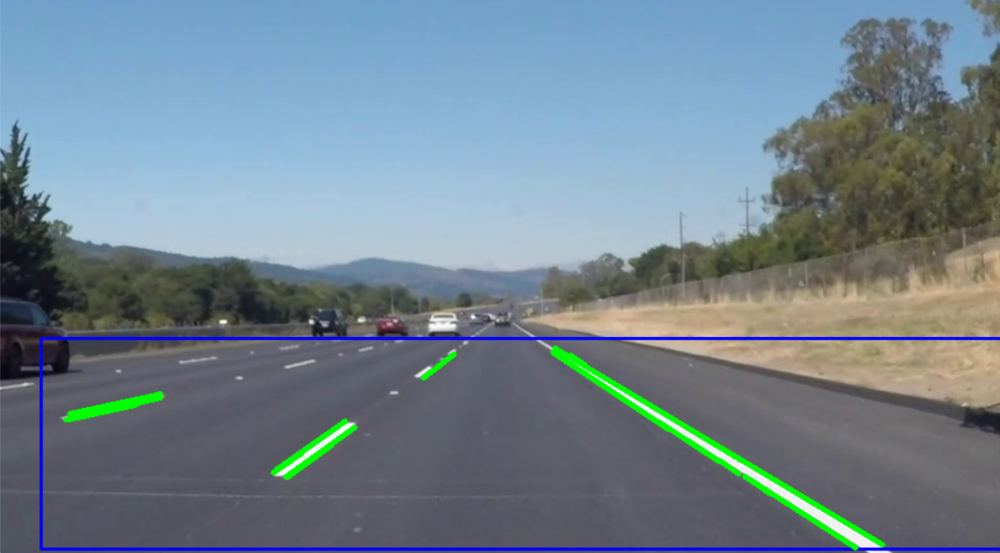

# 🚗 Lane Detection using OpenCV

This project detects road lane lines from video input using computer vision techniques with Python and OpenCV.

---

## 📌 Features

✅ Manual Region of Interest (ROI) selection  
✅ White lane detection  
✅ Edge detection using Canny algorithm  
✅ Line detection using Hough Transform  
✅ Real-time video processing  

---

## 🖼️ Output Example



---

## 🛠️ Technologies

- Python
- OpenCV
- NumPy

---

## 📂 Project Structure

```
LaneDetection
 ├── Lane_Detection
 │     └── lane_detection.py
 ├── data
 │     └── road01.mp4
 ├── result.png
 └── README.md
```

---

## ▶️ Installation

Clone the repository:

```
git clone https://github.com/YOUR_USERNAME/LaneDetection.git
```

Go to project folder:

```
cd LaneDetection
```

Install dependencies:

```
pip install opencv-python numpy
```

---

## ▶️ Usage

Run the script:

```
python Lane_Detection/lane_detection.py
```

When the program starts:

- Select the Region of Interest (ROI) using your mouse  
- Press ENTER or SPACE to confirm selection  
- Press **Q** to exit the program  

---

## 🎥 Sample Video

You can replace the input video inside the `data` folder with your own road video.

---

## 📊 Algorithm Pipeline

1. Select Region of Interest (ROI)
2. Apply image dilation
3. Convert frame to grayscale
4. Detect white lane pixels
5. Apply binary threshold
6. Detect edges using Canny
7. Detect lane lines using Hough Transform
8. Draw detected lanes on original frame

---

## 👩‍💻 Author

Haniyeh Ghahrmani

